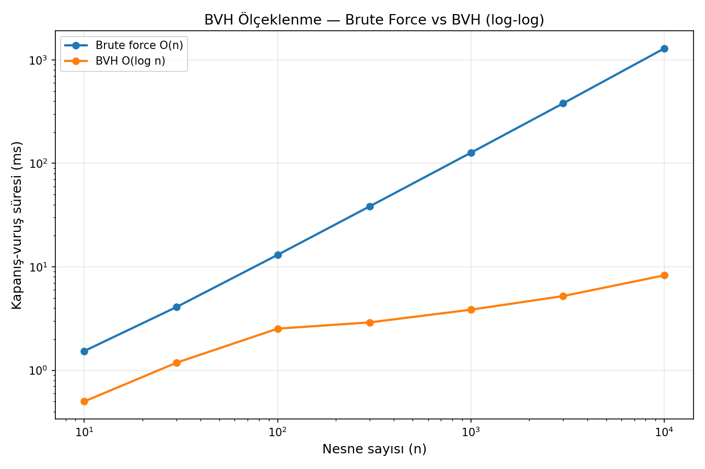
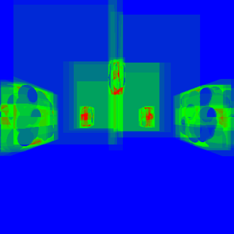
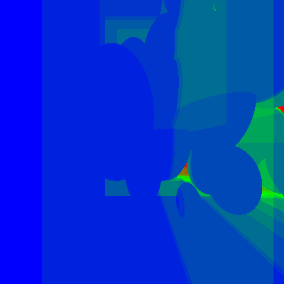
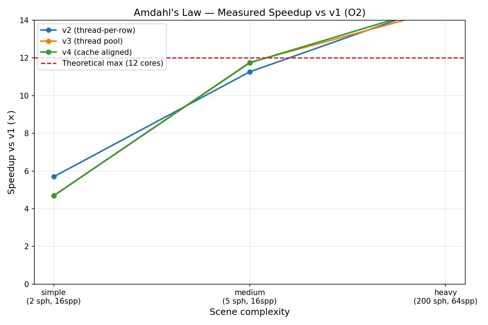
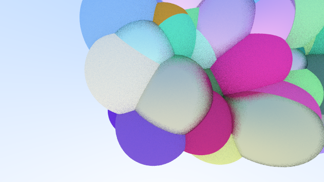
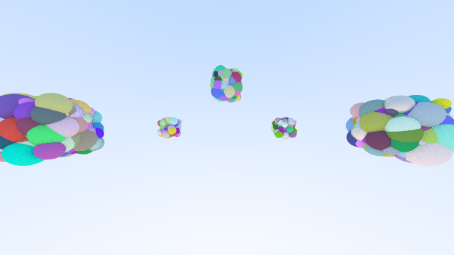
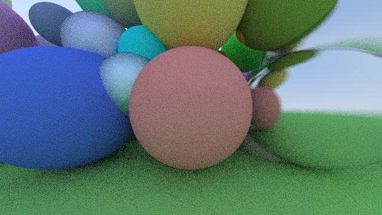

# Multi-Threaded Ray Tracing Engine

**Enes F. Erkmen** · C++17 · zero external dependencies · Ubuntu Linux / AMD Ryzen 5 5600X

A ray tracer written from scratch with nothing but the C++ standard library: no OpenCV, no libpng, no Boost, no test framework. The goal is not photorealism. The goal is **measurable systems and performance engineering**: build the naive solution, measure it, find the bottleneck, fix it, and prove the fix with numbers.

The engine evolves along a strict, dependency-forced chain:

```
FIX  ->  BVH  ->  DOD  ->  SIMD  ->  DIST  ->  SCALE
```

Each phase must produce a *provable* result ("we measured X, we proved Y"), not just working code.

---

## Results at a Glance

### 1. BVH on the real render path: ~419x faster

Same 100,000-object scene, same settings, the only difference being the intersection structure:

| | Brute force (`Scene::hit()`, O(n)) | BVH (`Bvh::hit()`, O(log n)) |
|---|---:|---:|
| Render time | 9224.37 ms | **22.07 ms** |

### 2. O(n) vs O(log n), measured across four orders of magnitude

A dedicated benchmark (`bench/bench_bvh.cpp`) fires a fixed 200x200 primary-ray grid, with no shading and no RNG, through both paths and times each:

| n | brute force | BVH | speedup | nodes | depth |
|---:|---:|---:|---:|---:|---:|
| 10 | 1.54 ms | 0.50 ms | 3.1x | 7 | 2 |
| 100 | 13.06 ms | 2.53 ms | 5.2x | 63 | 5 |
| 1,000 | 126.80 ms | 3.86 ms | 32.9x | 511 | 8 |
| 10,000 | 1289.44 ms | 8.27 ms | **156x** | 7,711 | 12 |



Brute force is a straight line on the log-log plot (slope ~1, confirming O(n)); the BVH curve flattens. A `checksum` accumulator (sum of `rec.t` over all hits) is kept for both paths. It defeats dead-code elimination under `-O3` and doubles as a free correctness check. The checksums matched exactly at every n.

### 3. SAH vs median-split: an honest, three-axis comparison

The BVH ships with two build strategies. Binned SAH (16 bins, all axes) is the default; median-split is retained as the comparison baseline. Same scene, same ray grid, three independent axes: predicted cost, wall clock, and *actually measured* traversal steps.

| n | median (ms) | SAH (ms) | cost (median) | cost (SAH) | visits (median) | visits (SAH) |
|---:|---:|---:|---:|---:|---:|---:|
| 10 | 0.66 | 0.74 | 4.08 | 4.02 | 38.68 | 40.34 |
| 100 | 2.67 | 2.58 | 12.52 | 10.73 | 37.88 | 33.92 |
| 1,000 | 3.75 | 3.56 | 51.12 | 44.58 | 41.50 | 44.06 |
| 3,000 | 5.32 | 4.90 | 102.93 | 94.36 | 47.57 | 44.21 |
| 10,000 | 8.77 | 8.08 | 260.33 | 240.66 | 66.43 | 62.45 |

The three axes deliberately do **not** all point the same way. On a *uniform* sphere cloud, SAH's win is small (~5-8% wall clock for n >= 100) and the measured visit count is inconsistent: at n=10 and n=1,000 SAH actually visits *more* nodes. SAH's real advantage shows up on **clustered, irregular** scenes, where its predicted cost is **45% lower** than median-split's at n=1,000. This is a build-quality heuristic, not a universal win, and the numbers are reported as such.

CPU counters tell the same story from a third angle (`--scene bench --count 10000`, fixed seed):

| Metric | Median-split | SAH | Note |
|---|---:|---:|---|
| Task clock | 379.6 ms | 376.1 ms | ~0.9%, noise on a uniform scene |
| Instructions | 6.06 B | **5.77 B** | ~4.9% less work |
| IPC | 3.46 | 3.33 | slight drop |
| Cache-miss rate | 10.08% | 8.68% | improved |
| BVH nodes used | 7,711 | **6,713** | ~13% fewer nodes |
| Tree depth | 12 | 14 | deeper, since SAH optimizes cost rather than balance |
| Heap peak | 6,657,547 B | 6,657,547 B | **identical**, see below |
| Hotspot | `Bvh::hit()` 64.9% | `Bvh::hit()` 56.8% | traversal share dropped |

The identical heap peak is a real finding, not a measurement error. The arena pre-allocates the worst-case `2n-1` nodes, and the post-build trim shrinks `size()` but not `capacity()`, so a strategy that genuinely uses fewer nodes cannot show any memory win under the current allocation scheme. That is precisely what the upcoming data-oriented/allocator phase targets.

### 4. Traversal heatmap: turning a number into a picture

`--mode heatmap` renders each pixel by the number of BVH nodes the ray visited (blue = cold/few, red = hot/many), reusing the instrumented traversal path.

| Clustered scene (BVH's weak spot) | Uniform bench scene (control) |
|---|---|
|  |  |

The ghosts of the five clusters' bounding boxes are clearly visible on the left: wide warm rectangles exactly where the boxes overlap and pruning fails. The uniform scene on the right is almost entirely cold, since scattered spheres let the BVH prune nearly every ray immediately. The color follows real scene structure, not noise.

### 5. Refit vs rebuild: the sawtooth

For dynamic scenes, rebuilding the tree every frame is expensive. `Bvh::refit()` keeps the topology frozen and only recomputes the boxes bottom-up. It is cheap, but tree quality decays as objects drift away from their original split planes. A sweep over rebuild intervals N, with a small moving-sphere subset, measures exactly that trade-off:

```
N=5,  frames 0-4   (4 consecutive refits): cost 14.6746 -> 14.7109   (strictly rising)
N=5,  frame 5      (rebuild)             : cost 14.7109 -> 14.7050   (reset)
N=20, frames 10-19 (9 consecutive refits): cost 15.1637 -> 15.2163   (strictly rising)
N=20, frame 20     (rebuild)             : drops
```

The sawtooth is real but not a clean monotonic ramp: the sinusoidal motion is periodic, so cost also dips inside some sub-ranges. Reported as observed rather than smoothed into a prettier curve.

### 6. Threading baseline



Amdahl's law with `p ~ 0.95` on 6 physical / 12 logical cores. Four findings worth keeping:

| # | Finding | Value |
|---|---|---|
| 1 | Thread-per-row hit **super-linear** speedup on the heavy scene | 14.93x against a theoretical 12x ceiling, thanks to `thread_local` RNG plus a friendly cache access pattern |
| 2 | `-O3` was sometimes *slower* than `-O2` | 4.8% slower on the heavy scene, L1-icache misses +206% |
| 3 | `alignas(64)` false-sharing fix | context switches -70%, but wall clock only -1.8%, since the counter is a tiny slice of the hot path |
| 4 | Threading *strategy* beats thread *count* | the pool loses on small scenes (queue overhead never amortizes), wins or ties on large ones |

### 7. Sample renders

| `bench` n=10,000 | `clustered` n=1,000 | `complex` (855 objects) |
|---|---|---|
|  |  |  |

---

## Roadmap

| Phase | Content | Status |
|---|---|---|
| 1 | **Stabilize & Unify Baseline**: memory/thread safety, CLI hardening, build & script hygiene, one unified renderer | Complete |
| 2 | **BVH Median-Split Baseline**: flat index-array BVH, O(log n) closest hit, brute-force parity proof | Complete |
| 3 | **BVH SAH + Traversal Tooling**: binned SAH build, cost model, traversal heatmap, refit vs rebuild study | Complete |
| 4 | **Data-Oriented Design**: SoA primitives/materials behind a custom arena allocator, before/after cache-miss proof | Next |
| 5 | **SIMD Vectorization (AVX2)**: hand-written 8-wide ray-AABB, scalar parity, verified vectorization, ray packets | Planned |
| 6 | **Distributed Core**: raw POSIX TCP master-worker, length-prefixed wire protocol, tile as work unit, pull scheduling | Planned |
| 7 | **Distributed Resilience**: heartbeat/failover, UDP discovery, live monitoring, bandwidth/latency measurement | Planned |
| 8 | **Distributed I/O Evolution**: thread-per-connection to `epoll` to `io_uring`, lock-free master queue | Planned |
| 9 | **Scale to Render Farm**: multi-machine speedup curve and chaos-tested fault tolerance on real LAN hardware | Planned |

Deliberately out of scope: path tracing / global illumination, denoising, gRPC/ZeroMQ/MPI (the point is writing the wire protocol by hand), cloud/Kubernetes, and container-simulated workers.

---

## Build and Run

```bash
make                # release build, -O2
make fast           # -O3
make debug          # -O0 -g -fsanitize=thread   (data-race hunting)
make asan           # -O1 -g -fsanitize=address  (memory-safety gate)
make profile        # -O2 -pg                    (gprof)

make run T=8        # render 1280x720 with 8 threads
make animate T=8    # orbit animation frames into output/animation/
make timelapse      # 1/2/4/6/8/12-thread comparison video
make plot           # Amdahl speedup chart

make test           # compile + run all four unit-test binaries
make bench          # build the BVH scaling benchmark
make bench-run      # build + run + plot the scaling CSV in one step
make bench-refit    # build the refit-vs-rebuild N-sweep benchmark
make clean
```

`debug` and `asan` are deliberately separate targets, not one flag added to the other. ThreadSanitizer catches cross-thread data races; AddressSanitizer catches single-threaded memory-safety bugs (buffer overflow, use-after-free). The BVH's flat node arena and the `reserve()`-then-`&element` scene-building pattern are both single-threaded risks that TSan structurally cannot see.

### CLI

```bash
./raytracer --threads 12 --mode pool --scene bench --count 10000 \
            --width 1280 --height 720 --samples 16 --depth 5 \
            --seed 42 --output output/renders/render.ppm
```

| Flag | Description | Default |
|---|---|---|
| `--threads N` | Worker count, clamped to 16 with a warning if higher | `hardware_concurrency()` |
| `--mode M` | See the mode table below | `single` |
| `--scene S` | `simple` (2) · `medium` (5) · `complex` (855) · `bench` (n) · `clustered` (n) | `simple` |
| `--count N` | Object count for `bench` / `clustered` | `1000` |
| `--width W` `--height H` | Image size (>= 2 each) | `1280` x `720` |
| `--samples N` | Samples per pixel, >= 1 | `4` |
| `--depth D` | Max ray bounce depth, >= 0 | `5` |
| `--frames N` | Animation frame count, >= 1 | `72` |
| `--seed N` | Omitted gives the original deterministic scene; given gives a different but reproducible scene | none |
| `--output F` | Output path | `output.ppm` |
| `--animate` / `--timelapse` | Shorthand for the matching modes | none |

| Mode | Behavior |
|---|---|
| `single` | Single-threaded reference path, the baseline every optimization is measured against |
| `naive` | One `std::thread` per scanline, kept as the deliberate contrast case |
| `pool` / `aligned` | ThreadPool + 64x64 tiles + cache-line-aligned progress counters. **The recommended path** |
| `animate` / `animate-single` | LookAt orbit animation, frames into `output/animation/` |
| `timelapse` | Same frame loop, output into `output/timelapse/` for the per-thread-count comparison video |
| `heatmap` | Per-pixel BVH traversal-step heatmap |

Every run prints BVH build statistics to stderr, in the same style as the `Threads: N` line:

```
BVH: nodes=511 depth=8 avg_leaf=3.9 build=0 ms
BVH_LEAF_HIST: 3:24 4:232
```

Both lines are grep-parseable by design, so benchmark scripts need no extra flag. The numbers cross-validate each other: `24*3 + 232*4 = 1000 = --count`; 256 leaves + 255 internal = 511 nodes; `log2(256) = 8` depth; `1000/256 = 3.9` average leaf.

**Requirements:** `g++` with C++17 (13.3 used here). Optional: `ffmpeg` (video), `python3` + `matplotlib` (plots), ImageMagick `convert` (PPM to PNG).

---

## Tests

```bash
make test
```

Four standalone binaries, hand-rolled `assert` + `printf`, no framework (the zero-dependency rule applies to tests too). Each is its own translation unit with a `main()`. `make test` stops at the first failure, so the terminal output alone tells you which file broke.

| Test | What it proves |
|---|---|
| `tests/test_sphere.cpp` | Ray-sphere intersection: hit, miss, `t_max` interval rejection, unit-normal invariant |
| `tests/test_aabb.cpp` | Slab-test edge cases: straight hit/miss, negative-direction swap, axis-parallel miss, ray origin inside the box, `0/0` NaN without a crash |
| `tests/test_bvh.cpp` | `Scene::hit()` (brute force) vs `Bvh::hit()` equivalence: 14 hand-built fixed rays plus a deterministic 64x64 camera ray grid (4,096 comparisons, no RNG), plus SAH-vs-brute-force parity and a `SAH cost <= median cost` assertion on a clustered scene |
| `tests/test_refit.cpp` | Move a sphere, call `refit()`, and confirm hit results are identical to a freshly rebuilt tree within 1e-6 |

**Why ray-level and not pixel-level:** the renderer seeds a `thread_local std::mt19937` from `std::random_device`, so two runs of the *same* mode already differ pixel by pixel. Byte-exact parity is structurally impossible in a Monte-Carlo renderer; the correct question is whether the difference is only converging noise. Comparing at the `HitRecord` level (`t`, `normal`, `point`, `mat_ptr`) sidesteps the sampling layer entirely and allows exact/epsilon comparison.

---

## Architecture

```
ProjectRayTracing/
├── src/
│   ├── vec3.h              3D vector / point / color, incl. operator[]
│   ├── ray.h               parametric ray: r(t) = o + t*d
│   ├── aabb.h              axis-aligned box, NaN-safe slab test, surface_area()
│   ├── hittable.h          abstract contract: hit() + bounding_box()
│   ├── Sphere.h            sphere geometry and ray-sphere intersection
│   ├── scene.h             brute-force linear scan (C++-level reference only)
│   ├── bvh.h               flat/index BVH: median-split + binned SAH, pruned traversal, refit()
│   ├── scene_builders.h    build_scene_bench() / build_scene_clustered()
│   ├── camera.h            viewport to world space, LookAt orbit
│   ├── material.h          Lambertian (diffuse) + Metal (reflective, clamped fuzz)
│   ├── ppm.h               PPM P3 output + buffered PPMWriter
│   ├── renderer.h/.cpp     render_tile(const Hittable&, ...) + TILE_SIZE
│   ├── threadpool.h/.cpp   task queue, mutex, condition_variable
│   ├── progress.h          cache-line-aligned atomic progress bar
│   └── main.cpp            CLI parsing, scene setup, render dispatch
├── tests/                  test_sphere / test_aabb / test_bvh / test_refit
├── bench/                  bench_bvh.cpp (scaling), bench_refit.cpp (N-sweep)
├── scripts/                make_video.sh, plot_ahmdal.py, plot_bvh_scaling.py
├── assets/                 images referenced in this README
├── results/                raw perf / massif / gprof / mpstat data
└── Makefile
```

### Two architectural hinges

Every future phase attaches at one of two seams, without rewriting the other:

- **`Hittable::hit()`**, the geometry layer. `Bvh` slots in where `Scene` used to be, purely by implementing the same interface. SoA layout and SIMD intersection go *below* this line.
- **`render_tile()`**, the execution layer. It takes a `const Hittable&`, so it neither knows nor cares which acceleration structure it is traversing. GPU backends and distributed tile dispatch go *above* this line, and the existing 64x64 tile is already the natural network work unit.

### Data flow (pool mode)

1. `main()` parses and validates the CLI, then builds the scene into `std::vector` storage with an up-front `reserve()`.
2. A `Bvh` is built **eagerly**, once, before any render dispatch. This keeps build time out of the render measurement and avoids a first-call build race between pool workers.
3. The image is partitioned into `TILE_SIZE`x`TILE_SIZE` tiles; each becomes a `std::function<void()>` pushed onto the pool's queue.
4. Workers pop tasks under a mutex, release it, then run `render_tile()`, casting `samples` jittered rays per pixel and recursing through `ray_color()` up to `depth` bounces.
5. Pixels are written with **no lock at all**: tile bounds are mathematically disjoint, so no two workers ever touch the same pixel.
6. `pool.shutdown()` is the synchronization barrier; then the buffer is serialized to PPM.

---

## Technical Notes

### Ray-sphere intersection

Substituting the ray `P = o + t*d` into the sphere equation `|P - C|^2 = R^2` (with `oc = o - C`):

```
t^2(d.d) + 2t(d.oc) + (oc.oc - R^2) = 0
```

Using the half-b reduction `b = 2h`, the discriminant becomes `D = h^2 - a*c`:

```cpp
double h            = ray.direction.dot(oc);
double discriminant = h*h - a*c;
double t            = (-h - sqrt(discriminant)) / a;
```

`D < 0` means a miss, `D = 0` a tangent, `D > 0` two roots, of which the nearer valid one in `[t_min, t_max]` wins. `t_min = 0.001` prevents shadow acne.

### AABB and the slab test

The ray-box test is the cheapest possible pre-filter, and its guarantee is absolute: if the ray misses the box, it cannot hit anything inside it. The implementation uses the branchless ternary formulation, which is NaN-safe by construction. An axis-parallel ray produces `0/0` on that axis, and IEEE-754 comparison semantics (every comparison involving NaN is false) would silently send a naive implementation down the wrong branch. This is unit-tested explicitly rather than assumed.

`AABB` also carries an empty sentinel (`min = +inf`, `max = -inf`) so that an untouched box can be detected. `grow()` refuses to absorb a sentinel operand, a bug that once corrupted SAH bin boxes to infinite surface area, which in turn made the cost-termination check fire on every clustered-scene root call, leaving the tree unsplit at depth 0.

### BVH: flat arena, two build strategies

**Storage.** Nodes live in a `std::vector<BVHNode>`, children referenced by `int` index, never by pointer. The arena is sized to the worst case (`2n - 1`) *before* the build starts, so `push_back` is never called during construction. This structurally eliminates the dangling-reference class of bug rather than defending against it. Primitives themselves are never moved; the build permutes a `std::vector<int>` of indices.

**Median-split** picks the axis with the widest centroid spread and partitions with `std::nth_element`, which is O(n) per node rather than a full sort.

**Binned SAH** (`SAH_BINS = 16`, all three axes) evaluates split candidates against the surface-area cost model (`C_trav = 1.2`, `C_isect = 1.0`) and terminates into a leaf when no split beats the cost of not splitting. It is deeper and cheaper than median-split: deeper because it optimizes cost, not balance. SAH is the default build strategy, and the choice is deliberately *not* exposed as a CLI flag, keeping the user-facing surface minimal while both strategies stay reachable from benchmarks and tests.

**Traversal** is iterative with an explicit stack. Boxes are pruned against the current closest `t`, and the geometrically nearer child is visited first, determined from the sign of the ray direction on the node's split axis. Near-first ordering is what makes early-out pruning actually pay off; visiting the far child first would find a hit that the near child immediately supersedes.

**`refit()`** walks the node array in reverse. Because children are always allocated after their parent, a reverse walk guarantees every node's children are already up to date when its own box is recomputed, so no recursion is needed. Leaves rebuild their box from live primitive positions; internal nodes take the union of two already-refitted children. Topology (`left_first`, `prim_count`, `split_axis`) is untouched.

### Threading

- **Read-only shared state needs no lock.** The scene is built before any thread exists and never mutates during the render, so `Scene::hit()` and `Bvh::hit()` are lock-free by construction.
- **Disjoint write regions need no mutex.** Tile boundaries never overlap, so pixel writes are race-free by design, an invariant maintained by the tiling math rather than by the type system.
- **No busy waiting.** Workers block on `cv.wait(lock, predicate)`; the predicate guards against spurious wakeups and against the lost-wakeup race (`stop_flag` is always mutated under the mute
